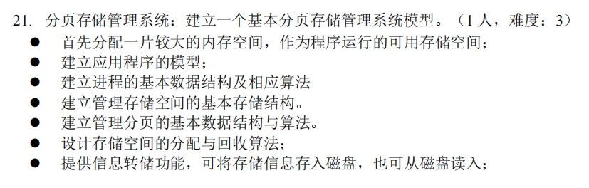
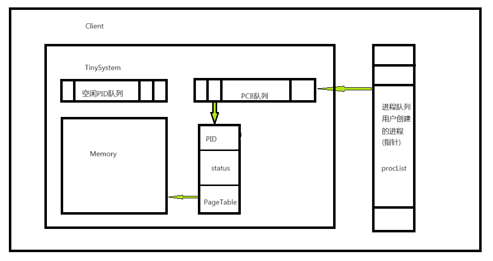

## Page_Memory_Management

> 操作系统分页系统模拟

环境：gcc	CMake 	Windows/Linux 	vscode

本项目是本人操作系统的一个简单课设，在此记录



### 运行方法：

windows平台下，vscode项目中.vscode/settings.json文件中添加(电脑里安装过MinGW)

```json
"cmake.generator": "MinGW Makefiles"
```

使用{projectDir}/client/head/client.h文件中的宏`UNIT_TEST`进行控制。如果定义该宏，则运行单元测试，如果未定义，则运行主程序。

主程序是一个简单的命令行，通过输入命令执行目标操作，括号代表参数，冒号是单位，pid，size是整数类型且均大于零，fileName是字符串。

```c
/*****************************************************************************
 * 命令行输入解析
 * 命令列表：command (args) (...)
 * help                     get help                        --获取帮助信息
 * exit                     shutdown system                 --关闭系统退出程序
 * cp (size:KB)      		creat process                   --创建进程
 * dp (pid)                 destroy process                 --销毁进程
 * pa (pid) (size:KB)       process allocate memory         --进程开辟内存
 * sd (pid)                 store process to disk           --将进程存入磁盘
 * ld (fileName)            load program from disk          --从磁盘载入程序
 * sp (pid)                 show process message            --显示进程具体信息
 * ls                       list all process                --显示所有进程
 * ss                       show system message             --显示当前系统信息
 * 例如: cp 4,创建一个进程，该进程初始大小4KB
*******************************************************************************/
```

在Windows平台下开为不同情况的输出设置了不同的颜色。

### 项目概述

**{projectDir}/src**下主要是系统模型设计，包括页表(PageTable)，主存(Memory)，进程控制块(PCB)，进程(Process)，系统(TinySystem)，其中还设计了一个简易的队列数据结构(QueueLite)。

**{projectDir}/client**下主要是展示页面的设计，包含一个简易的命令窗口，输出相关信息。

系统总体框架



#### head.h

定义了一些类型，宏，基本函数

```c
typedef enum { TYPE_FALSE, TYPE_TRUE } bool_type; // bool 类型

typedef uint16_t base_type; // 定义数量类型，例如页表项的数量，栈的长度
typedef uint32_t address_type;  // 定义地址类型

#define SIZE_OF_PAGE 4 * 1024 // Page的大小
#define MAX_PID 20 // 进程的最大数量

// 定义单位方便测试 (Unit:byte)
#define _KB (1 * 1024)
#define _MB (1 * 1024 * 1024)

// 取最大，最小值
address_type MAX(address_type left, address_type right);
address_type MIN(address_type left, address_type right);
```

#### client.h

接口界面实现

#### QueueLite

轻量级队列，用于内存分配回收，pid分配

```c
// 轻量级队列
struct QueueLite
{
    base_type *ptr;     // 队列本体
    base_type capacity; // 队列容量
    base_type size;     // 队列长度
    base_type head;     // 队列头部
    base_type tail;     // 队列尾部
};
```


#### 主存模型

模拟的主存大小为32MB，其中系统占用8MB空间，剩下的24MB是用户区，用来运行进程，分页大小为4KB每页。这里只对用户区空间进行分页，系统区不考虑。规定每个进程最大内存为4MB，因此只需要一级页表。

```c
/********************************************************************************
 * 总内存为32Mbyte，至少需要使用26位来描述，这里使用uint32_t
 * 整个主存分为两段，前一段是system区，后面是用户区，通过offset区分
 * |-----------------------------| 0x01FFFFFF 32M-1 Page 8*1024-1
 * |                             |
 * |------------user-------------|
 * |                             |
 * |                             |
 * |                             |
 * |                             |
 * |                             |
 * |                             |
 * |============offset===========| 0x00800000 8M    Page 2*1024
 * |                             |
 * |                             |
 * |                             |
 * |-----------system------------|
 * |                             |
 * |-----------------------------| 0x00000000       Page 0
 * ****************************************************************************
 * |        页号P(20位)        |    偏移量(12位)        |
 ********************************************************************************/

/* Memory 代表主存，单例对象，用来描述主存*/
struct Memory
{
    char *memory; // 主存
    address_type offset; // 用户段的偏移量
    address_type sys_used; //系统区已使用量
    address_type user_used;// 用户区已使用量
    struct QueueLite *mem_queue; //用于存放空闲的页的页号
};
```

#### 页表模型

```c
/********************************************************************************
 * 整个系统可用内存空间为32M，最多需要32M/4K=8K个page
 * 每一个Page大小为4Kbyte，系统按字节编址，地址长度为32位
 * 一个页表最多有1024项，每一项指向一个4K大小的页，因此一个页表最多管理4K*1024 =4M内存
 * 假设每个进程最多只允许申请4M内存，所以只需要一级页表
 * |************************************************|
 * |        逻辑页号        |         物理页号        |
 * |        逻辑页号        |         物理页号        |
 * |        逻辑页号        |         物理页号        |
 * |        逻辑页号        |         物理页号        |
 * |        逻辑页号        |         物理页号        |
 * |        逻辑页号        |         物理页号        |
 * |        逻辑页号        |         物理页号        |
 * |        逻辑页号        |         物理页号        |
 * |        逻辑页号        |         物理页号        |
 * |        逻辑页号        |         物理页号        |
 **|************************************************|***************************/

// 页表
struct PageTable
{
    base_type *table; /* 0--65535 指向页表实体的指针 */
    base_type size; /* 已使用的最大页表项数，页表项的个数最多1024 */
    struct QueueLite *queue; // 存放未使用的页号
};
```

#### PCB模型

```c
// PCB
typedef enum {Ready, Execute, Block, Undefined} CPU_STATUS; // Undefined表示未知
struct ProcessControlBlock
{
    base_type pid;                  // pid==MAX_PID 表示此PCB未被使用，否则代表进程编号
    CPU_STATUS status;              // 处理机状态 就绪，执行，阻塞，未知
    struct PageTable *page_table;   // 指向内存中页表的指针
};
```

#### 进程模型

```c
// 进程模型
struct Process
{
    struct ProcessControlBlock *pcb; // 进程的PCB
    address_type size; // 进程的占用的内存总大小
    struct TinySystem *sys; //系统，单例对象
};
```

#### 系统模型

```c
// 系统模型
struct TinySystem
{
    struct QueueLite *pidQueue;         // 空闲Pid队列
    struct Memory *mem;                 // 主存储器实例
    struct ProcessControlBlock **PCBs;  // PCB队列
};
```

#### 分页算法

每4KB大小为一页，因此用户区共有24MB/4KB=6K个页面。对于页面分配这里设计了两种方案，一是在系统初始化时按从0到6K的顺序依次将序号插入队列；二是将所有页面分为四组，分组的规则是页序号对{1,2,3,4}取余为0的为一组，依次插入各组，所以顺序是0,4,8....1,5,9...2,6,10...3,7,11......进程申请内存时从队列头获取页面序号并分配。当进程申请内存时，从系统来看分配的单位是页，从进程来看分配的单位是字节。例如一个进程第一次申请了5KB内存，则系统分配给他2页(8K)，当该进程下次请求2KB内存时，则系统不会再分配一页而是使用已有的页面。

#### 回收算法

回收比较简单，销毁进程时，直接将其拥有的页号全部加入队列即可。

### 其他

#### 不足之处

1. 对于进程回收内存没有设计好，因此在命令行界面阉割了该功能。
2. 没有考虑多进程并发，从设计结构看来，Memory和System都是单例对象多个进程同时申请资源时必然会冲突，因此需要加锁。同时由于客户端命令行界面执行也是单线程，如果考虑多线程模拟，进程列表`procList`也成为临界资源，使用需要加锁。


